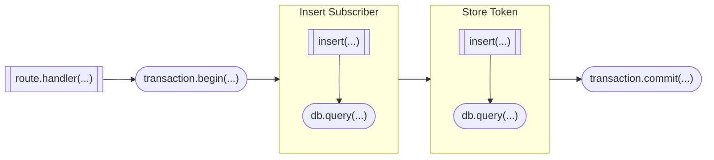
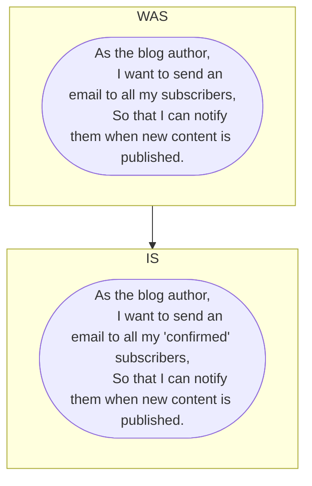

<div id="top"></div>

<h1 align="center">Zero To Axum: It's Surreal</h1>

<div align="center">
  <a href="https://github.com/snarkipus/zero2axum/actions/workflows/ci.yaml">
    
  </a>
  <a href="https://codecov.io/gh/snarkipus/zero2axum">
    
  </a>
  <a href="https://github.com/snarkipus/zero2axum/actions/workflows/audit.yml">
    
  </a>
  <a href="https://github.com/snarkipus/zero2axum/actions/workflows/fly.yaml">
    
  </a>
</div>

<div align="center">
  <br />
  <div align="center">
    <a href="https://github.com/snarkipus/zero2axum">
      
    </a>
  </div>
</div>

# Status

- [x] Chapter 1: Getting Started 
- [x] Chapter 2: Building an Email Newsletter ([v0.1.2](https://github.com/snarkipus/zero2axum/releases/tag/v0.1.2))
- [x] Chapter 3: Sign Up a New Subscriber ([v0.1.3](https://github.com/snarkipus/zero2axum/releases/tag/v0.1.3))
- [x] Chapter 4: Telemetry ([v0.1.4](https://github.com/snarkipus/zero2axum/releases/tag/v0.1.4))
- [x] Chapter 5: Going Live ([v0.1.5](https://github.com/snarkipus/zero2axum/releases/tag/v0.1.5))
- [x] Chapter 6: Reject Invalid Subscribers #1 ([v0.1.6](https://github.com/snarkipus/zero2axum/releases/tag/v0.1.6))
- [x] Chapter 7: Reject Invalid Subscribers #2 ([v0.1.7](https://github.com/snarkipus/zero2axum/releases/tag/v0.1.7))
- [x] Chapter 8: Error Handling([v0.1.8](https://github.com/snarkipus/zero2axum/releases/tag/v0.1.8))
- [x] Chapter 9: Naive Newsletter Delivery([v0.1.9](https://github.com/snarkipus/zero2axum/releases/tag/v0.1.9))
- [ ] Chapter 10: Securing our API
- [ ] Chapter 11: Fault Tolerant Workflows

# Build Log & Changes

## Rust Resources
- [Zero To Production In Rust](https://www.zero2prod.com/)
- [Rust Axum Full Course - Web Development](https://www.youtube.com/watch?v=XZtlD_m59sM)
- [Introduction to Axum](https://www.youtube.com/playlist?list=PLrmY5pVcnuE-_CP7XZ_44HN-mDrLQV4nS)
- [Building a Rust service with Nix](https://fasterthanli.me/series/building-a-rust-service-with-nix)

## SurrealDB Resources
- [SurrealDB - Rust Embedded Database - Quick Tutorial](https://www.youtube.com/watch?v=iOyvum0D3LM)
- [Beyond Surreal? A closer look at NewSQL Relational Data](https://www.youtube.com/watch?v=LCAIkx1p1k0)
- [Testing SurrealDB](https://dev.to/ndrean/testing-surrealdb-1kjl) (See section on Graph Queries)
- [SurrealDB: Your Ultimate Guide to Smooth Installation and Configuration](https://travishorn.com/surrealdb-your-ultimate-guide-to-smooth-installation-and-configuration)
- [Awesome Surreal](https://github.com/surrealdb/awesome-surreal)
- [Concurrency Example](https://github.com/surrealdb/surrealdb/blob/main/lib/examples/concurrency/main.rs)
### DB Utilities
- [surrealdb-migrations](https://github.com/Odonno/surrealdb-migrations/)
- [Surrealist DB Explorer](https://github.com/StarlaneStudios/Surrealist)

### DB CLI / SurrealQL

<details>

<summary>Example SurrealQL Terminal Session</summary>

```
❯ target/release/surreal sql --conn ws://localhost:8000 --user surreal --pass password
> INFO FOR KV;
[{ ns: { default: 'DEFINE NAMESPACE default' } }]

> USE NS default;
[]

default> INFO FOR NS;
[{ db: { "`03358854-c64b-4218-ac5e-0a9f0ef6d9e0`": 'DEFINE DATABASE `03358854-c64b-4218-ac5e-0a9f0ef6d9e0`', "`0db7dbcd-36ab-44ab-bd4e-7e0a671fc257`": 'DEFINE DATABASE `0db7dbcd-36ab-44ab-bd4e-7e0a671fc257`', "`1d5d717c-e548-45a5-bca9-1f9d555df047`": 'DEFINE DATABASE `1d5d717c-e548-45a5-bca9-1f9d555df047`', "`1e88b4cd-7a1b-4dc9-a7a6-4b9113a0104b`": 'DEFINE DATABASE `1e88b4cd-7a1b-4dc9-a7a6-4b9113a0104b`', "`2ea5190c-bd20-43b6-b9f1-a72d61f08eb8`": 'DEFINE DATABASE `2ea5190c-bd20-43b6-b9f1-a72d61f08eb8`', "`30332091-8f2f-4276-a479-56be361c60a5`": 'DEFINE DATABASE `30332091-8f2f-4276-a479-56be361c60a5`', "`3226719f-41f7-4b0c-9b0b-44f81318838b`": 'DEFINE DATABASE `3226719f-41f7-4b0c-9b0b-44f81318838b`', "`32e61988-1490-4940-8da7-b24dc41f6125`": 'DEFINE DATABASE `32e61988-1490-4940-8da7-b24dc41f6125`', "`419938a5-f9e1-41ac-943d-3289dc1b98ad`": 'DEFINE DATABASE `419938a5-f9e1-41ac-943d-3289dc1b98ad`', "`53a87388-8163-447f-b512-914b153045fc`": 'DEFINE DATABASE `53a87388-8163-447f-b512-914b153045fc`', "`556f7657-2d7d-4dea-8f53-2b2337c62276`": 'DEFINE DATABASE `556f7657-2d7d-4dea-8f53-2b2337c62276`', "`5e8c1b46-ddd2-40f9-8cdf-3603665fb432`": 'DEFINE DATABASE `5e8c1b46-ddd2-40f9-8cdf-3603665fb432`', "`5ed41f41-8538-435a-9e73-1e3c455a2252`": 'DEFINE DATABASE `5ed41f41-8538-435a-9e73-1e3c455a2252`', "`6416fdf9-a335-4ee2-9c5e-1b7048c14ce2`": 'DEFINE DATABASE `6416fdf9-a335-4ee2-9c5e-1b7048c14ce2`', "`736d865f-0fcf-4834-a506-a117a84384f3`": 'DEFINE DATABASE `736d865f-0fcf-4834-a506-a117a84384f3`', "`7b5c1533-165f-499d-a126-2596fe2ff5fd`": 'DEFINE DATABASE `7b5c1533-165f-499d-a126-2596fe2ff5fd`', "`8513744a-4148-422d-8029-a83555cdce30`": 'DEFINE DATABASE `8513744a-4148-422d-8029-a83555cdce30`', "`9744022e-ef87-41c1-9bf2-7c01b6ec01ab`": 'DEFINE DATABASE `9744022e-ef87-41c1-9bf2-7c01b6ec01ab`', "`a2bb8f4e-1b60-4aab-958d-3cadfcd4f682`": 'DEFINE DATABASE `a2bb8f4e-1b60-4aab-958d-3cadfcd4f682`', "`a4dbdf37-008e-4052-813c-db7df07f9f79`": 'DEFINE DATABASE `a4dbdf37-008e-4052-813c-db7df07f9f79`', "`b9182537-ab0f-4d78-b821-1d7338ecfa71`": 'DEFINE DATABASE `b9182537-ab0f-4d78-b821-1d7338ecfa71`', "`c51c93e5-118c-4111-901c-4be338729174`": 'DEFINE DATABASE `c51c93e5-118c-4111-901c-4be338729174`', "`d231d5f7-55b8-4d45-9789-8043624390fd`": 'DEFINE DATABASE `d231d5f7-55b8-4d45-9789-8043624390fd`', "`df0ced2c-945d-4e73-83cc-bde46385077f`": 'DEFINE DATABASE `df0ced2c-945d-4e73-83cc-bde46385077f`', "`e097fb8e-c07e-4676-b7f9-99073fac7398`": 'DEFINE DATABASE `e097fb8e-c07e-4676-b7f9-99073fac7398`', "`e485535d-a90f-4d74-a163-82b4890bf8a8`": 'DEFINE DATABASE `e485535d-a90f-4d74-a163-82b4890bf8a8`', "`f2d0c249-a5ed-42a8-9d01-536bb6c69ef3`": 'DEFINE DATABASE `f2d0c249-a5ed-42a8-9d01-536bb6c69ef3`', "`f7deb705-6e6c-4b61-be16-54e2e6ce2a4f`": 'DEFINE DATABASE `f7deb705-6e6c-4b61-be16-54e2e6ce2a4f`', "`fa49ab02-c35a-4d93-b210-f0756031a008`": 'DEFINE DATABASE `fa49ab02-c35a-4d93-b210-f0756031a008`', "`fe8abdf9-00c7-48c6-862e-101a9c5cceec`": 'DEFINE DATABASE `fe8abdf9-00c7-48c6-862e-101a9c5cceec`', newsletter: 'DEFINE DATABASE newsletter' }, nl: {  }, nt: {  } }]

default> USE DB `03358854-c64b-4218-ac5e-0a9f0ef6d9e0`;
There was a problem with the database: There was a problem with the database: Parse error on line 1 at character 15 when parsing '-c64b-4218-ac5e-0a9f0ef6d9e0;'

default/03358854-c64b-4218-ac5e-0a9f0ef6d9e0> INFO FOR DB;
[{ dl: {  }, dt: {  }, fc: {  }, pa: {  }, sc: {  }, tb: { subscriptions: 'DEFINE TABLE subscriptions SCHEMAFULL' } }]

default/03358854-c64b-4218-ac5e-0a9f0ef6d9e0> INFO FOR TABLE subscriptions;
[{ ev: {  }, fd: { email: 'DEFINE FIELD email ON subscriptions TYPE string ASSERT $value != NONE AND is::email($value)', id: 'DEFINE FIELD id ON subscriptions TYPE string ASSERT $value != NONE', name: 'DEFINE FIELD name ON subscriptions TYPE string ASSERT $value != NONE', subscribed_at: 'DEFINE FIELD subscribed_at ON subscriptions TYPE datetime ASSERT $value != NONE' }, ft: {  }, ix: { email: 'DEFINE INDEX email ON subscriptions FIELDS email UNIQUE', idIndex: 'DEFINE INDEX idIndex ON subscriptions FIELDS id' } }]

default/03358854-c64b-4218-ac5e-0a9f0ef6d9e0> SELECT * FROM subscriptions;
[{ email: 'ursula_le_guin@gmail.com', id: subscriptions:xf8xb288jdyx8ay12r1k, name: 'le guin', subscribed_at: '2023-05-21T03:24:38.086917396Z' }]
```

</details>

## Solutions
- [Zero To Production](https://github.com/LukeMathWalker/zero-to-production/tree/main)
- [Zero To Production (with axum)](https://github.com/mattiapenati/zero2prod)
- [An implementation of Zero To Production In Rust using Axum instead of Actix (partial)](https://github.com/SaadiSave/zero2prod)


## Docs

| Crate | Docs |
| --- | --- |
| Axum | [0.6.18](https://docs.rs/axum/0.6.18/axum/) |
| Tokio | [1.28.1](https://docs.rs/tokio/1.28.1/tokio/) |
| tracing | [0.1.37](https://docs.rs/tracing/0.1.37/tracing/) |
| color_eyre | [0.6.2](https://docs.rs/color-eyre/0.6.2/color_eyre/) |
| rstest | [0.17.0](https://docs.rs/rstest/0.17.0/rstest/) |
| surrealdb | [1.0.0-beta.9](https://docs.rs/surrealdb/1.0.0-beta.9+20230402/surrealdb/) |


## Chapter 1
- Toolchain: 1.69.0
- Linker: [mold](https://github.com/rui314/mold) (v1.11.0)
- Code Coverage: [LLVM source-based coverage](https://github.com/taiki-e/cargo-llvm-cov) w/[Codecov](https://about.codecov.io/) integration

## Chapter 2
- no change

## Chapter 3
- Framework: Axum (0.6.16)
- Aync Runtime: Tokio (1.27.0)
- Environment: [git-crypt](https://dev.to/heroku/how-to-manage-your-secrets-with-git-crypt-56ih), [direnv](https://direnv.net/)
- Error Handling:
  - [Sentry](https://www.sentry.io)
  - color-eyre
- Logs:
  - tracing/tracing-subscriber
  - serde, serde_json
- Testing:
  - httpc_test, rstest
- Database:
  - SurrealDB, [surrealdb-migrations](https://github.com/Odonno/surrealdb-migrations)

## Chapter 4
- Telemetry:
  - [ ] TODO: OpenTelemetry w/Honeycomb: [Honeycomb.io](https://ui.honeycomb.io)
  - [ ] TODO: Verify Sentry (will address with error handling - it's a mess right now)

## Chapter 5
- A bit different w/SurrealDB
  - No offline compile-time verification
  - No 'lazy' connection to SurrealDB (would require refactoring initialization code to endpoint handler - doable, but dumb)

- Ok, so I'm going to have to refactor this stupid thing - it totally breaks the flow of the book if I don't
  - [x] Instead of a connection pool, pass configurations
  - [x] Initialize database connection (post init.sh migration) at the handler
  - [x] Major refactor of the tests to create configs/migrations within the tests

### Deployment Configuration
- zero2axum:
  - ~~Dockerfile deployment via `spec.yaml` to Digital Ocean Apps~~
    - Turns out that managing `git-crypt` secrets with Dockerfile deployment and DO Apps Framework sucks (or at least I couldn't figure it out)
  - Switched to Fly.io:
    - [x] Local deployment via `flyctl deploy` after using `fly launch` to generate the `fly.toml` config file worked painlessly (and without wrestling with git-crypt)
    - [x] [Fly.io CD Setup](https://fly.io/docs/app-guides/continuous-deployment-with-github-actions/)
- SurrealDB (5.4.4 Connecting To Digital Ocean’s Postgres Instance): 
  - [x] ~~VPS w/Docker deployment to Digital Ocean Droplet~~
  - This got needlessly complicated and non-automated (domain names, etc.) - I might as well just host my own
  - [x] Host SurrealDB on personal VPS (in my case, k3s cluster running on Hetzner)
  - [x] SSL does horrible, terrible things and doesn't work [Bug: 1929](https://github.com/surrealdb/surrealdb/issues/1929) ([Fix: PR#1960](https://github.com/surrealdb/surrealdb/pull/1960))
  - [x] Refactor 'production' environment to reflect `Wss` vs. `Ws` connection and new database endpoint
  - [ ] Noticed that the initial schemaful migration run in the init script for local dev isn't being run for prod, so there are no unique constraints ... this would have broken with Postgres ... need to figure this out
  - For now, just doing a manual migration using the surreal cli:
    `surreal import --conn https://my.db.here -u surreal -p password --ns default --db newsletter schemas/script_migration.surql` (also requires nightly, source built surreal since ssl is broken in beta-9)

## Chapter 6
- Type Safety: just a note, lack of `sqlx` kinda sucks ... 6.5 clearly shows the issue where a query is binding a field to a struct (instead of &str), and I know that will explode ... but it's silent without anything that guarantees type-safe queries.
- Pretty straightforward - only some minor errata around the `fake` crate and using `Arbitrary` ... no longer uses rng as a trait; now it uses a struct - there's a link to the issue in the source
    
## Chapter 7
### 7.2.2.2 Connection Pooling
> ... most HTTP clients offer connection pooling: after the first request to a remote server
has been completed, they will keep the connection open (for a certain amount of time) and re-use it if we
need to fire off another request to the same server, therefore avoiding the need to re-establish a connection
from scratch.

>`reqwest` is no different - every time a Client instance is created reqwest initialises a connection pool under
the hood.

>To leverage this connection pool we need to reuse the same Client across multiple requests.
It is also worth pointing out that Client::clone does not create a new connection pool - we just clone a
pointer to the underlying pool.

### 7.2.2.3 How to Reuse the same `reqwest::Client` in ~~`actix-web`~~ `Axum`
> To re-use the same HTTP client across multiple requests in actix-web we need to store a copy of it in the
application context - we will then be able to retrieve a reference to Client in our request handlers using an
extractor (e.g. actix_web::web::Data).

How do?

#### Option 1:
> Derive the Clone trait for EmailClient, build an instance of it once and then pass a clone to app_data
every time we need to build an App

#### Option 2:
> Wrap EmailClient in actix_web::web::Data (an Arc pointer) and pass a pointer to app_data every
time we need to build an App - like we are doing with PgPool:

Which one?

> If EmailClient were just a wrapper around a Client instance, the first option would be preferable - we avoid
wrapping the connection pool twice with Arc. This is not the case though: EmailClient has two data fields attached (base_url and sender). The first implementation allocates new memory to hold a copy of that data every time an App instance is created, while the second shares it among all App instances. That’s why we will be using the second strategy.

#### NOTE:
- `axum-macros` crate with `#[debug_handler]` on the route handler makes [debugging](https://docs.rs/axum-macros/latest/axum_macros/attr.debug_handler.html) A LOT easier

Ok, so this might be one of the bigger differences I've seen between Actix and Axum (so far) ... the sharing of State information. Where Actix allows the `app_data` to be passed atomically, Axum requires the state to be packaged into a struct of some kind.

Regardless, the naive approach of just cloning the entire structure would be "Option 1," ... so we'll have to wrap the EmailClient in an `Arc` by hand

So, for us ... we can do something like this (no idea if this is correct, I had to derive `clone` on the whole thing, which seems like it's not quite right):

```rust 
#[derive(Clone)]
pub struct AppState {
    pub configuration: Settings,
    pub email_client: Arc<EmailClient>,
}
```
Then, we can set up the `AppState` like this in the async `run()` function:
```rust
let state = AppState {
    configuration,
    email_client: Arc::new(email_client),
};
```
Then, on the handler side, we can do the following to extract `AppState`:
```rust
pub async fn handler_subscribe(
    Extension(state): Extension<AppState>,
    Form(data): Form<FormData>,
) -> Result<impl IntoResponse> {...}
```
Oddly, that works ... tests are all green.

### 7.2.3 HTTP Mocking with ~~`wiremock`~~ `mockito`
Long story short - just use `wiremock`.
#### Issues
- No match trait to implement, only an `Into<`Matcher>`, which can return one of the `Matcher` enum types ... probably a way to do that, but beyond my skill level
- No exposed `.with_delay()` method ... you have to use `.with_chunked_body()` and pass a closure ... and the sleep thread seems to block in the main test thread

### 7.6 Database Stuff
Note: ChatGPT is ***really good*** at generating ERDs from SQL using Mermaid syntax

#### 3.8.4.2.3: Initial Migration
##### SQL
```sql
CREATE TABLE subscriptions(
  id uuid NOT NULL,
  PRIMARY KEY (id),
  email TEXT NOT NULL UNIQUE,
  name TEXT NOT NULL,
  subscribed_at timestamptz NOT NULL
);
```
##### Equivalent SurrealQL
```sql
DEFINE TABLE subscriptions SCHEMAFULL;

DEFINE FIELD id ON subscriptions TYPE string ASSERT $value != NONE;
DEFINE INDEX id ON TABLE subscriptions COLUMNS id UNIQUE;
DEFINE FIELD email ON subscriptions TYPE string ASSERT $value != NONE AND is::email($value);
DEFINE INDEX email ON TABLE subscriptions COLUMNS email UNIQUE;
DEFINE FIELD name ON subscriptions TYPE string ASSERT $value != NONE;
DEFINE FIELD subscribed_at ON subscriptions TYPE datetime ASSERT $value != NONE;
```


#### 7.6.4.1: Schema Update Migration
##### SQL
```sql
ALTER TABLE subscriptions ADD COLUMN status TEXT NULL;
```
##### Equivalent SurrealQL
```sql
DEFINE FIELD status ON subscriptions;
```

#### 7.6.4.3: Backfill & Mark as NOT NULL
##### SQL
```sql
BEGIN;
  -- Backfill `status` for historical entries
  UPDATE subscriptions
    SET status = 'confirmed'
    WHERE status IS NULL;
  -- Make `status` mandatory
    ALTER TABLE subscriptions ALTER COLUMN status SET NOT NULL;
COMMIT;
```
##### Equivalent SurrealQL
```sql
BEGIN TRANSACTION;
UPDATE subscriptions SET status = 'confirmed' WHERE status = NONE;
DEFINE FIELD status ON subscriptions TYPE string ASSERT $value != NONE;
COMMIT TRANSACTION;
```
#### 7.6.5 New Table

##### SQL
```sql
CREATE TABLE subscription_tokens(
  subscription_token TEXT NOT NULL,
  subscriber_id uuid NOT NULL
  REFERENCES subscriptions (id),
  PRIMARY KEY (subscription_token)
);
```

In this diagram:

- The new table `subscription_tokens` is added to the class diagram. It has two fields: `subscription_token` and `subscriber_id`.
- `subscription_token` : `TEXT [PK]` indicates that the `subscription_token` field is a primary key in the `subscription_tokens` table.
- `subscriber_id` : `uuid` indicates that the `subscriber_id` field is of type `uuid`.
- The arrow from `subscription_tokens` to `subscriptions` with `subscriber_id` as the label indicates that `subscriber_id` is a foreign key referencing the `id` field of the `subscriptions` table. The `"1"` and `"*"` symbols on the sides of the arrow indicate cardinality, meaning that each `subscription_token` is associated with exactly one `subscription`, and each `subscription` can be associated with multiple `subscription_tokens`.

Now, what's interesting is that in SurrealDB, the relationship between the `subscription_tokens` table and the `subscriptions` table isn't handled using a foreign key. The important fact is:
>  each `subscription_token` is associated with exactly one `subscription`, and each `subscription` can be associated with multiple `subscription_tokens`

 It's probably handled using a graph edge created by the `RELATE` statement. I'm guessing something along the lines of:
```sql
RELATE subscriptions:id->create->subscriber_id:id SET subscription_token = $token;
```
For now, we'll just create the table and wait for Luca to explain how & when we're generating tokens.
##### Equivalent SurrealQL
```sql
DEFINE TABLE subscription_tokens SCHEMAFULL;

DEFINE FIELD subscription_token ON subscription_tokens TYPE string ASSERT $value != NONE;
DEFINE FIELD subscriber_id ON TABLE subscription_tokens TYPE string ASSERT $value != NONE;
DEFINE INDEX subscriber_id on TABLE subscription_tokens COLUMNS subscriber_id UNIQUE;
```
### 7.7 Sending a Confirmation Email
Things got a little squirrely here, and in the first attempt, I neglected to set the mock server's email address properly in `tests/api/helpers.rs: spawn_app()`. Not trusting mockito and struggling to debug this, I just reverted to `wiremock` for all mocking/testing. Turns out this was probably wise since email verification depends on the `received_requests()` method from `wiremock`, and this would have been some effort to do with `mockito` ... maybe just extend it? I dunno ...

#### Detour: Refactor State Management

I was lamenting that using `Extract()` state was shared as a monolith and envious of the fact that Actix had a much more elegant pattern. It turns out that Axum does as well. In fact, there are some pretty good reasons _not_ to use the `Extract()` method ... namely type safety and runtime explosions.

- **[Axum Blog Post](https://tokio.rs/blog/2022-11-25-announcing-axum-0-6-0)**
> Previously the recommended way to share state with handlers was to use the Extension middleware and extractor: ...<br> However this wasn't type safe, so if you forgot .layer(Extension(...)) things would compile just fine but you'd get runtime errors when calling handler ...<br>In 0.6 you can use the new State extractor which works similarly to Extension but is type safe...

- **[Axum State for Reqwest Client](https://stackoverflow.com/questions/75727029/axum-state-for-reqwest-client)**<br>
It turns out someone else tried to do this ... just need the `FromRef` trait, which can be derived via macro

- **[Axum Docs: axum::extract::State Substates](https://docs.rs/axum/latest/axum/extract/struct.State.html#substates)**

#### 7.7.5 Connecting the Dots

##### 7.7.5.2
> Let’s begin by taking care of that URL issue.
It is currently hard-coded in

> The domain and the protocol are going to vary according to the environment the application is running
into: it will be http://127.0.0.1 for our tests, it should be a proper DNS record with HTTPS when our
application is running in production.
The easiest way to get it right is to pass the domain in as a configuration value.
Let’s add a new field to ApplicationSettings: ...

**TODO:** 
- [X] FIGURE THIS OUT FOR FLY.IO: CD will be broken until this is resolved

- Set the production API key so that Postmark will get the correct header:
  
`flyctl secrets set APP_EMAIL_CLIENT__AUTHORIZATION_TOKEN=API-TOKEN-GOES-HERE`

- Rigged the configuration code to 'fake' the right format:

```rust
if environment == Environment::Production {
    let mut base_url = std::env::var("FLY_APP_NAME").expect("FLY_APP_NAME must be set");
    base_url.push_str(".fly.dev");
    std::env::set_var("APP_APPLICATION__BASE_URL", base_url);
};
```
```yaml
#! spec.yaml
# [...]
services:
  - name: zero2prod
  # [...]
  envs:
    # We use DO's APP_URL to inject the dynamically
    # provisioned base url as an environment variable
    - key: APP_APPLICATION__BASE_URL
      scope: RUN_TIME
      value: ${APP_URL}
      # [...]
# [...]
```
> Remember to apply the changes to DigitalOcean every time we touch spec.yaml: grab your app
identifier via doctl apps list --format ID and then run doctl apps update $APP_ID --spec
spec.yaml.

Well, Fly.io provides a very small amount of [environment variables](https://fly.io/docs/reference/runtime-environment/#environment-variables) to the runtime. 

Now, according to the [docs](https://fly.io/docs/getting-started/working-with-fly-apps/) ... And the app's name is available via `FLY_APP_NAME` ... which one would intuit that the `base_url` should eventually resolve to `http://${FLY_APP_NAME}`.

I'm pretty sure that the following code is where the change needs to happen (configuration.rs):
```rust
pub fn get_configuration() -> Result<Settings, config::ConfigError> {
    let base_path = std::env::current_dir().expect("Failed to determine the current directory.");
    let configuration_directory = base_path.join("configuration");

    let environment: Environment = std::env::var("APP_ENVIRONMENT")
        .unwrap_or_else(|_| "local".into())
        .try_into()
        .expect("Failed to parse APP_ENVIRONMENT.");
    let environment_filename = format!("{}.yaml", environment.as_str());
    let settings = config::Config::builder()
        .add_source(config::File::from(
            configuration_directory.join("base.yaml"),
        ))
        .add_source(config::File::from(
            configuration_directory.join(environment_filename), // <-- "local" or "production" yaml
        ))
        .add_source(
            config::Environment::with_prefix("APP") // <--  designed for Digital Ocean: APP_FOO__BAR
                .prefix_separator("_")              //      Change: needs to use FLY_APP_NAME
                .separator("__"),
        )
        .build()?;

    settings.try_deserialize::<Settings>()
}
```

## DETOUR: [Surreal Thing Notes](SurrealStuff)
Pretty massive detour here to move away from pure uuid-based ids and to `Thing`, which is unique to SurrealDB. Not a huge fan, but at least all the tests are passing. This brings us to ...

---

### 7.8.2 Transactions
Well, this would be yet another place where not using Postgres or sqlx makes things a little different. 

SurrealDB does have a concept of [transaction](https://surrealdb.com/docs/surrealql/transactions), but any pooling will have to be done the hard way.

I dunno ... maybe we can do something clever by making a general-purpose DB adapter thing with some baked-in smarts. Maybe add a simple transaction manager impl to the DB object ...

So, it's interesting working through this as a novice database guy ... so much emphasis in Postgres is placed on the connection. SurrealDB, using Websockets, doesn't have to deal with any of the pooling. It would seem that the sqlx! Transaction manager grabs a connection from the pool and holds it open while it fills up a queue with pending transactions, then commits them once you pull the trigger. My naive implementation just queues up a bunch of surql strings (maybe even validated?) and spits them out as a transaction. ~~I may add a method to easily just execute it.~~ After discussing with ChatGPT, changes were made, and things were done. 
```rust
#[derive(Clone, Debug, Default)]
pub struct QueryManager {
    pub queries: Vec<String>,
}

impl QueryManager {
    pub fn new() -> QueryManager {
        QueryManager {
            queries: Vec::new(),
        }
    }

    #[tracing::instrument(
        name = "Adding query to QueryManager",
        skip(self, query),
        fields(
            query = %query
        )
    )]
    pub fn add_query(&mut self, query: &str) -> Result<()> {
        let query = sql::parse(query).context("Failed to parse query")?;
        self.queries.push(query.to_string());
        Ok(())
    }

    pub fn generate_transaction(&self) -> Transaction {
        let mut transaction = String::from("BEGIN TRANSACTION;\n");
        for query in &self.queries {
            transaction.push_str(query);
            transaction.push_str(";\n");
        }
        transaction.push_str("COMMIT TRANSACTION;");
        Transaction(transaction)
    }

    #[tracing::instrument(name = "Executing QueryManager", skip(self, db))]
    pub async fn execute(&mut self, db: &Surreal<Client>) -> Result<()> {
        let transaction = self.generate_transaction();
        tracing::debug!(transaction = %transaction.0);
        match db.query(transaction).await {
            Ok(_) => {
                self.queries.clear();
                Ok(())
            }
            Err(e) => Err(e.into()),
        }
    }
}

pub struct Transaction(pub String);

impl AsRef<str> for Transaction {
    fn as_ref(&self) -> &str {
        &self.0
    }
}

impl IntoQuery for Transaction {
    fn into_query(self) -> Result<Vec<Statement>, surrealdb::Error> {
        sql::parse(self.as_ref())?.into_query()
    }
}
```
This worked on a toy repo, so it should work well enough for this. It just won't be nearly as fancy as a grown-up version.
> Back to the code: how do we leverage transactions in sqlx?
You don’t have to manually write a BEGIN statement: transactions are so central to the usage of relational
databases that sqlx provides a dedicated API.
By calling `begin` on our pool we acquire a connection from the pool and kick off a transaction:

We're choosing to ignore getting a connection from a pool since that's what cool kids do.
> `begin`, if successful, returns a Transaction struct.
A mutable reference to a Transaction implements sqlx’s Executor trait therefore it can be used to run
queries. All queries run using a Transaction as executor become of the transaction.
Let’s pass transaction down to insert_subscriber and store_token instead of pool:

I'm lazy, so I just create the struct when we create the database, which exposes an `execute` trait to murder all the transactions in its queue. Logic should still hold, though; we can pass the struct down to our database functions since it's conveniently bundled up in our `AppState`. Errrmmm .... mutable state is a thing, apparently.

Gnarly ... `tokio::mutex` is a thing ... this is stupidly hard.

**Update**: After thinking on this a bit more, for now all of the transactions are bundled relative to a specific handler. I don't actually need the transaction manager queue to be mutable/shared across multiple handlers (that's crazily complicated and seems like an anti-pattern). I just need to create an instance of the transaction manager 'scoped' to the handler. This _should_ allow me to avoid cross-thread stuff. I dunno - we'll see how it works. In non-threaded testing, it [works](https://github.com/snarkipus/surreal-thing/blob/55c385619f984d456f172abe57f1040c8ad91090/tests/queries.rs#L107-L137) as [designed](https://github.com/snarkipus/zero2axum/blob/5564b7dd48df01de4fcbf99ce5d9555e2fd66285/src/db.rs#L88-L149). Shocking, that approach worked. All tests pass - just the fly.io environment variable loose end to chase down.

Not gonna lie - this chapter almost did me in.

Extra Credit:
- [ ] TODO: What happens if a user tries to subscribe twice? Make sure that they receive two confirmation emails;
- [ ] TODO: What happens if a user clicks on a confirmation link twice?
- [ ] TODO: What happens if the subscription token is well-formatted but non-existent?
- [ ] TODO: Add validation on the incoming token; we are currently passing the raw user input straight into a
query (thanks sqlx for protecting us from SQL injections <3);
- [ ] TODO: Use a proper templating solution for our emails (e.g., tera);
- [ ] TODO: At some point, it might be worth revisiting implementing `cargo-chef` instead of using `--mount=type=cache`, even if it's just to understand other alternatives to build artifact caching. 
- See [post](https://www.reddit.com/r/rust/comments/13yafcl/comment/jmmay3h/?utm_source=share&utm_medium=web2x&context=3)
## Chapter 8

**Error Location vs Purpose**
| | Internal | At the edge |
|---|---|---|
| **Control Flow** | Types, methods, fields | Status codes |
| **Reporting** | Logs/traces | Response body |

### 8.2 Operator Errors

Well, somewhat stuck right out of the gate - turns out I'll have to be creative in getting SurrealDB to fail. Despite having `SCHEMAFULL` definitions, SurrealDB will accept all incoming transactions (if valid), which is a known [bug](https://github.com/surrealdb/surrealdb/issues/2060).

So, we'll just add which should fail since the token is a string:
```sql
DEFINE FIELD subscription_token ON subscription_tokens TYPE number ASSERT $value != NONE AND is::numeric($value);
```

```log
ERROR: test/27878 on Zeus: [ADDING A NEW SUBSCRIBER. - EVENT] Failed to execute transaction: Api(Query("The query was not executed due to a failed transaction")) (db_name=4e0426f4-3343-4c90-8083-70fc9bf6fddd,file=src/routes/subscriptions.rs,line=103,method=POST,request_id=cb2fa959-9b15-4e04-8b28-a54c26a16d90,subscriber_email=ursula_le_guin@gmail.com,subscriber_name="le guin",target=zero2axum::routes::subscriptions,uri=/subscribe,uuid=5b70a28f-0fcb-46f6-ba1a-582521be32b0)
```

```log
ERROR: test/27878 on Zeus: [REQUEST - EVENT] response failed (classification="Status code: 500 Internal Server Error",latency="16 ms",line=137,method=POST,target=tower_http::trace::on_failure,uri=/subscribe,uuid=5b70a28f-0fcb-46f6-ba1a-582521be32b0)
    file: /home/snarkipus/.cargo/registry/src/github.com-1ecc6299db9ec823/tower-http-0.4.0/src/trace/on_failure.rs
```

In this case, I had already created a `TraceLayer` in the Axum router definition:
```rust
        [...]
        .layer(
            TraceLayer::new_for_http().make_span_with(|request: &hyper::Request<Body>| {
                let uuid = Uuid::new_v4();
                tracing::info_span!(
                    "request",
                    uuid = %uuid,
                    method = %request.method(),
                    uri = %request.uri(),
                )
            }),
        )
        [...]
```

#### Axum Error Handling
This section will be unique to Axum since its approach is somewhat different from Actix. In the case of Axum,  There's a pretty good preview of what this could look like [here](https://github.com/jeremychone-channel/rust-axum-course/blob/main/src/error.rs).

- Axum References:
  - [Error Handling](https://docs.rs/axum/latest/axum/error_handling/index.html)
  - [IntoResponse (trait)](https://docs.rs/axum/latest/axum/response/trait.IntoResponse.html)
  - [map_response()](https://docs.rs/axum/latest/axum/middleware/fn.map_response.html)
  - [HandleError (struct)](https://docs.rs/axum/latest/axum/error_handling/struct.HandleError.html)
  - [HandleErrorLayer (struct)](https://docs.rs/axum/latest/axum/error_handling/struct.HandleErrorLayer.html)

**Options:**
- Implement `IntoResponse` for enumerated error types (similar to how the book does it) and use the `map_response()` middleware

---

#### `sqlx` Anatomy Detour
So, it turns out that the naive `QueryManager` is perhaps _too_ naive. It doesn't actually do what it's supposed to: send queries belonging to a `transaction` to the database as they arrive and then use the `commit` or `cancel` directives to handle the `transaction`.

So, I attempted to somewhat understand how `sqlx` does it under the hood, and it turns out it's pretty complicated (at least for me). Being "Database Agnostic" translates into a giant pile of traits and types which have to be implemented for a specific driver version (i.e., PostgreSQL). While I briefly (very briefly) toyed with the idea of attempting a SurrealDB derivation, it was quickly apparent that it's a hard-mode option better suited to savvy devs.
Here are some relevant notes to help me fix the naive API for the `QueryManager` ... I found the rat's nest of trait methods to be an interesting exercise.

* **`sqlx::query!("....")` Cheatsheet**:

| **Number of Rows** | **Method to Call\*** |	**Returns** |	**Notes** |
| --- | --- | --- | --- |
| None† |	`.execute(...).await`	| `sqlx::Result<DB::QueryResult>`	| For INSERT/UPDATE/DELETE without RETURNING.
| Zero or One	| `.fetch_optional(...).await` |	`sqlx::Result<Option<{adhoc struct}>>` | Extra rows are ignored. |
| Exactly One	| `.fetch_one(...).await` |	`sqlx::Result<{adhoc struct}>` |	Errors if no rows were returned. Extra rows are ignored. Aggregate queries, use this. |
| At Least One	| `.fetch(...)` |	`impl Stream<Item = sqlx::Result<{adhoc struct}>>` |	Call `.try_next().await` to get each row result. |
| Multiple |	`.fetch_all(...)` |	`sqlx::Result<Vec<{adhoc struct}>>` | |	

\* All methods accept one of `&mut {connection type}`: `&`mut Transaction` or `&Pool``.

† Only callable if the query returns no columns; otherwise, it’s assumed the query may return at least one row.

So, like it or not, the `Query` method ([docs](https://docs.rs/surrealdb/1.0.0-beta.9+20230402/surrealdb/method/struct.Query.html)) handles all of that. There's just not a fancy way to manage transactions per se.


* **`SQLx TransactionManager`**
```rust
pub trait TransactionManager {
    type Database: Database;

    /// Begin a new transaction or establish a savepoint within the active transaction.
    fn begin(
        conn: &mut <Self::Database as Database>::Connection,
    ) -> BoxFuture<'_, Result<(), Error>>;

    /// Commit the active transaction or release the most recent savepoint.
    fn commit(
        conn: &mut <Self::Database as Database>::Connection,
    ) -> BoxFuture<'_, Result<(), Error>>;

    /// Abort the active transaction or restore from the most recent savepoint.
    fn rollback(
        conn: &mut <Self::Database as Database>::Connection,
    ) -> BoxFuture<'_, Result<(), Error>>;

    /// Starts to abort the active transaction or restore from the most recent snapshot.
    fn start_rollback(conn: &mut <Self::Database as Database>::Connection);
}
```

* `SQLx Transaction`
```rust
pub struct Transaction<'c, DB>
where
    DB: Database,
{
    connection: MaybePoolConnection<'c, DB>,
    open: bool,
}

impl<'c, DB> Transaction<'c, DB>
where
    DB: Database,
{
    #[doc(hidden)]
    pub fn begin(
        conn: impl Into<MaybePoolConnection<'c, DB>>,
    ) -> BoxFuture<'c, Result<Self, Error>> {
        let mut conn = conn.into();

        Box::pin(async move {
            DB::TransactionManager::begin(&mut conn).await?;

            Ok(Self {
                connection: conn,
                open: true,
            })
        })
    }

    /// Commits this transaction or savepoint.
    pub async fn commit(mut self) -> Result<(), Error> {
        DB::TransactionManager::commit(&mut self.connection).await?;
        self.open = false;

        Ok(())
    }

    /// Aborts this transaction or savepoint.
    pub async fn rollback(mut self) -> Result<(), Error> {
        DB::TransactionManager::rollback(&mut self.connection).await?;
        self.open = false;

        Ok(())
    }
}

[...]

impl<'c, DB> Drop for Transaction<'c, DB>
where
    DB: Database,
{
    fn drop(&mut self) {
        if self.open {
            // starts a rollback operation

            // what this does depends on the database but generally this means we queue a rollback
            // operation that will happen on the next asynchronous invocation of the underlying
            // connection (including if the connection is returned to a pool)

            DB::TransactionManager::start_rollback(&mut self.connection);
        }
    }
}
```

That should give us enough information to get started ... for this application, the general flow should look something like this:


Unfortunately, the PostgreSQL implementation relies heavily on the viper's nest of traits, so I'm just going to naively flatten it into a simple struct with some basic `impl` methods somewhat derived from the PostgreSQL solution.

---

Ok, so in the end, error handling was pretty educational. I'm sure this implementation isn't completely correct, but in the end the concepts are still sound. The solution here, borrowed from Jeremy Chone, is to use the `response_mapper` middleware component to handle the errors (if present) in a granular fashion. This does overlap somewhat with the actual `IntoResponse` impl's for the errors themselves, so I'm sure there's some duplication/waste here. One thing I certainly don't fully understand is if you pay any sort of performance penalty for solving it this way. I'm sure the middleware doesn't come for free ... but for something like this, it very likely might be appropriate. One thing of interest is the ability to craft a client response and segregate it from the server logs cleanly. This subtly was lost on me in the incredibly dense YouTube video that Jeremy did.

## Chapter 9: Naive Newsletter Delivery


No surprises here - it's a straightforward chapter. 

## Chapter 10: Securing our API
### Contextual Errors
Early sections are straightforward - interesting wrinkle around the default `error_response` from Actix. It doesn't appear that Axum has an equivalent default.

#### Actix `ResponseError` Trait

```rust
pub trait ResponseError: Debug + Display {
    // Provided methods
    fn status_code(&self) -> StatusCode { ... }
    fn error_response(&self) -> HttpResponse<BoxBody> { ... }
}
```

However, using Axum does give you the ability to create custom, sexy responses like [this](https://fasterthanli.me/series/updating-fasterthanli-me-for-2022/part-2?source=techstories.org#the-opinions-of-axum-also-nice-error-handling).
- [ ] TODO: Implement customized error responses with `color-eyre` backtraces
- [ ] TODO: Implement/correct `color-eyre::Report` for error types
- [ ] TODO: Implement `eyre::Chain` method in place of recursive `err_chain` method

#### Actix Implementation
```rust
impl ResponseError for LoginError {
    fn error_response(&self) -> HttpResponse {
        let encoded_error = urlencoding::Encoded::new(self.to_string());
        HttpResponse::build(self.status_code())
            .insert_header((LOCATION, format!("/login?error={}", encoded_error)))
            .finish()
    }

    fn status_code(&self) -> StatusCode {
        StatusCode::SEE_OTHER
    }
}
```

#### Axum `IntoResponse` Trait
```rust
pub trait IntoResponse {
    // Required method
    fn into_response(self) -> Response<UnsyncBoxBody<Bytes, Error>>;
}
```

#### Axum Implementation
```rust
impl IntoResponse for LoginError {
    fn into_response(self) -> Response {
        let encoded_error = urlencoding::Encoded::new(self.to_string());
        Response::builder()
            .status(StatusCode::SEE_OTHER)
            .header("Location", format!("/login?error={}", encoded_error))
            .body(axum::body::boxed(Body::empty())) // <--- shenanigans
            .unwrap()
    }
}
```
Shenanigans ensue! Unsurprisingly, I found the answer from Amos on [Twitter](https://twitter.com/fasterthanlime/status/1526595055653355521?s=20).

- [x] TODO: HMAC Environment Variable
```
# You need to set the `APP_APPLICATION__HMAC_SECRET` environment variable
# on Digital Ocean as well for production!
```

Shell Command: `openssl rand -base64 32`

`flyctl secrets set APP_APPLICATION__HMAC_SECRET=RANDOM-NUMBER-GOES-HERE`

NOTE: I do feel like we're missing some sort of testing here. Perhaps this is where end-to-end testing would be ideal. I'm assuming if it existed in the Rust ecosystem that Luca would have included it - but I do wonder what it would look like.

### Cookies
Ask, and ye shall receive. Tests!

Of interest, though, is that Axum doesn't have a dedicated `cookie` API. We will have to use the `tower-cookies` crate. This ends up being almost silly (and somewhat magical). Just add a layer for the `CookieManager`, and then you can access the cookie jar from the handler directly to create a new cookie.

```rust
//! src/startup.rs
use tower_cookies::CookieManagerLayer;
[...]

pub async fn run(
    listener: TcpListener,
    configuration: Settings,
    email_client: EmailClient,
    database: Database,
) -> Result<ZServer> {
    [...]
    let app = Router::new()
        [...]
        .layer(CookieManagerLayer::new())
        [...]

    Ok(server)
}
```
```rust
//! src/routes/login/post.rs
use tower_cookies::{Cookie, Cookies};
[...]

pub async fn login(
    State(database): State<Database>,
    cookies: Cookies,
    Form(form): Form<FormData>,
) -> Result<Response, LoginError> {
    [...]
    cookies.add(Cookie::new("_flash", err.to_string()));
    [...]
}
```