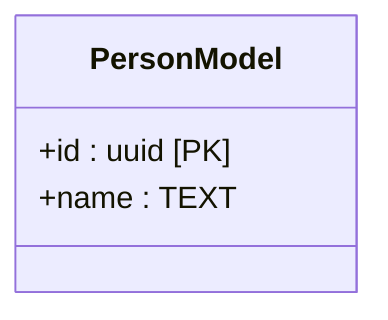
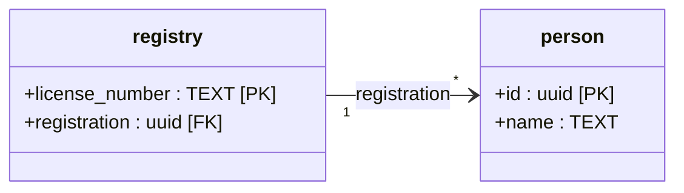

# Thing - Lots of Noise
WTF is a `Thing`. I came across this early on when I first tried to use `uuid` to generate the `id` of the `subscriptions` table. The value for `id` is generated by SurrealDB and the type has to be `Thing` or it doesn't work. This is the first time I've tried to get the `id` back out of the table ...

## Original Mayhem (archive)

### My Code:
```rust
    #[derive(serde::Deserialize)]
    struct TestQuery {
        email: String,
        name: String,
        status: String,
        id: Thing,
    }

    let saved: Option<TestQuery> = res.take(0).unwrap();
    match saved {
        Some(s) => {
            assert_eq!(s.email, "ursula_le_guin@gmail.com");
            assert_eq!(s.name, "le guin");
            assert_eq!(s.status, "pending_confirmation");
            dbg!(s.id);
        }
        None => panic!("No subscription found."),
    }
```
```terminal
[tests/api/subscriptions.rs:71] s.id = Thing {
    tb: "subscriptions",
    id: String(
        "tmnlrt58w1c6wfqiwe5p",
    ),
}
```

Interesting stuff here ... excerpt from Discord:

>**Nico Maybach** — Today at 6:45 AM<br>
With the new API I am getting the id as Thing:
```json
"id": {
        "tb": "user",
        "id": {
            "String": "pyibhuc8pptdy5x5hima"
        }
    },
```

>instead of just a String.
Is there a possibility to get it or convert it to a string, so I get just `id:
user:pyibhuc8pptdy5x5hima`?

<br>

>**Aeltoth** — Today at 6:52 AM<br>
Create your own type `pub struct Id(String);`.<br>Implement `Serialize` & `Deserialize` for this wrapper type so that:
During serialization it converts itself into a `Thing` and returns `Thing::serialize`
During deserialization it starts by attempting a `Thing::deserialize` and then you construct the struct out of the `id.tb` and `id.id.String` fields<br>
Finally implement `Deref` and `AsRef<str>` for Id to easily access the inner String or str 
It may seem cumbersome to use a custom type for your IDs but imo it's preferable to have a clear distinction between what is an ID and a regular String

- [Type Example](https://github.com/Aelto/surrealdb-architecture/blob/master/src/types/id.rs)
- [Implementation Example](https://github.com/Aelto/surrealdb-architecture/blob/master/src/models/message.rs#L11)
### Workaround
```rust
use surrealdb::sql::serde::serialize_internal;

let thing = Thing {
    tb: "table".into(),
    id: "id".into(),
};
let json = serialize_internal(|| serde_json::to_string(&thing))?;
let thing_de: Thing = serde_json::from_str(&json)?;
```
[`surrealdb::sql::serde::serialize_internal`](https://docs.rs/surrealdb/1.0.0-beta.9+20230402/surrealdb/sql/serde/fn.serialize_internal.html)

So, I think the workaround will get you from `json` to `Thing` and back ... not sure how helpful that really is.

On a related note ...

>**adaptive-alex** — 05/18/2023 4:43 AM<br>
> - If you want to set the ID upon creation just provide an ID in your struct.
> - If you want to be able to choose if it is randomly generated from Surreal you can have your id be `Option<YourIdType>` and have serde not serialize option `None`.
> - If you want the newly created random ID you have to deserialize it which currently takes some handling on your part before it's stabilized. You can use:<br>
`serialize_internal(|| serde_json::to_string(&payload).expect("Failed to parse payload"))` to get a Thing out if you want to use the native type. Otherwise you just need to handle the deserialization some other way.

### SurrealDB References:
- [Surreal Thing Implementation](https://github.com/surrealdb/surrealdb/blob/main/lib/src/sql/thing.rs)
- [Surreal Id Implementation](https://github.com/surrealdb/surrealdb/blob/main/lib/src/sql/id.rs)

### Super helpful discussion (kudos to Aeltoth - creator of [Surreal Simple Query Builder](https://github.com/Aelto/surreal-simple-querybuilder)):
- [Original Question](https://discord.com/channels/902568124350599239/1014970959461105664/1111459847997759559)
- [Follow-on Thread](https://discord.com/channels/902568124350599239/1111606375307546684)

**FOR THE RECORD - QUERY RESPONSE DESERIALIZATION SUCKS!!!** (totally not a record ID pun ... but it should be)

---

# Reboot
Ok, let's pause ... thrashing just made a mess and _things_ have been broken.

Playground Repo: [surreal-thing](https://github.com/snarkipus/surreal-thing)

## Super Simple Example

Let's just pull down the SurrealDB [axum CRUD example](https://github.com/surrealdb/surrealdb/tree/main/lib/examples/axum).

### Axum API Endpoints
```rust
let app = Router::new()
    .route("/person/:id", post(person::create))
    .route("/person/:id", get(person::read))
    .route("/person/:id", put(person::update))
    .route("/person/:id", delete(person::delete))
    .route("/people", get(person::list))
    .with_state(db);
```

### Axum Event Handlers
```rust
const PERSON: &str = "person";

type Db = State<Surreal<Client>>;

#[derive(Serialize, Deserialize)]
pub struct Person {
	name: String,
}

pub async fn create(
	db: Db,
	id: Path<String>,
	Json(person): Json<Person>,
) -> Result<Json<Option<Person>>, Error> {
	let person = db.create((PERSON, &*id)).content(person).await?;
	Ok(Json(person))
}

pub async fn read(db: Db, id: Path<String>) -> Result<Json<Option<Person>>, Error> {
	let person = db.select((PERSON, &*id)).await?;
	Ok(Json(person))
}

pub async fn update(
	db: Db,
	id: Path<String>,
	Json(person): Json<Person>,
) -> Result<Json<Option<Person>>, Error> {
	let person = db.update((PERSON, &*id)).content(person).await?;
	Ok(Json(person))
}

pub async fn delete(db: Db, id: Path<String>) -> Result<Json<Option<Person>>, Error> {
	let person = db.delete((PERSON, &*id)).await?;
	Ok(Json(person))
}

pub async fn list(db: Db) -> Result<Json<Vec<Person>>, Error> {
	let people = db.select(PERSON).await?;
	Ok(Json(people))
}
```
Ok ... easy enough, simple CRUD API that we can `curl` up with.

Unforunately, the CRUD example uses rust client commands (which have magic) against a schemaless database and doesn't actually exercise queries at all. So let's bang on it that way so we have to deal with the `Response` object.

---

### Schema
So, here's a schema which _should_ be consistent with the CRUD endpoints. 
```sql
DEFINE TABLE person SCHEMAFULL;

DEFINE FIELD id ON person TYPE number ASSERT $value != NONE;
DEFINE INDEX id ON TABLE person COLUMNS id UNIQUE;
DEFINE FIELD name ON person TYPE string ASSERT $value != NONE;
```

### ERD

---
### Person Model
Now, ideally, we would just be able to reuse the original `Person`. However, the record ID is created automagically in a schemaless database and is transparent to the user. In our case, we want to explicily account for it while remaining consistent with the CRUD endpoint queries. So, let's make a model with an optional `Thing` field ... since thing resistance is futile. 

NOTE: For reasons too advanced for me, Discord says we should *not* serialize the `id` if it doesn't exist. I assume that's so we're not sending empty data.
```rust
#[derive(Debug, Serialize, Deserialize)]
struct PersonModel {
    #[serde(skip_serializing_if = "Option::is_none")]
    id: Option<Thing>,
    name: String,
}
```
---
### Create the Person
Ok, now let's try to just insert some dude named "Blaze". When we process the surql via query, we'll get a `Response` back with the record we just created. Let the fun begin ...
```rust
async fn create_person() {
    let db = create_db().await;
    
    // Simple stuff - SurrealDB handles creating the uuid() in the database
    let sql = "CREATE person:uuid() CONTENT { name: $name }";

    let mut res = db
        .query(sql)
        .bind(("name", "Blaze"))            
        .await
        .unwrap();
    
    // This just sucks - so much unwrapping 
    let person: PersonModel = res.take(0)
        .map(|p: Option<PersonModel>| p.unwrap())
        .unwrap();
    
    // This is actually a Thing
    let id = &person.id.unwrap();
    let name = &person.name;
    assert_eq!(id.tb, "person");
    assert_eq!(name, "Blaze");
    println!("id: {}", &id.id.to_raw());
}
```

Looking at the shape of `Response`:
```json
Response(
    {
        0: Ok(
            [
                Object(
                    Object(
                        {
                            "id": Thing(
                                Thing {
                                    tb: "person",
                                    id: String(
                                        "21d93fb7-342a-4a26-ac9d-fc0e3f31018a",
                                    ),
                                },
                            ),
                            "name": Strand(
                                Strand(
                                    "Blaze",
                                ),
                            ),
                        },
                    ),
                ),
            ],
        ),
    },
)
```

Ok...that's somewhat ridiculous, but we can work with it.  

Digging the `person` out of that mess via the ugliest unwrap ever ...
```rust
let person: Person = res.take(0)
    .map(|p: Option<PersonModel>| p.unwrap())
    .unwrap();
```
gets us ...
```json
PersonModel {
    id: Some(
        Thing {
            tb: "person",
            id: String(
                "9f089ba1-d2c3-4edc-9937-33487909252c",
            ),
        },
    ),
    name: "Blaze",
}
```

And finally ... we can extract the id via `println!("id: {}", &id.id.to_raw())`:
```term
id: 9f089ba1-d2c3-4edc-9937-33487909252c
```
---
#### CRUD Endpoint Verification
##### LIST (only one entry in the table)
```zsh
❯ curl http://127.0.0.1:8080/people
[{"name":"Blaze"}]%   
```

##### READ
```zsh
❯ curl http://127.0.0.1:8080/person/9f089ba1-d2c3-4edc-9937-33487909252c
{"name":"Blaze"}%   
```

##### UPDATE
```zsh
❯ curl -X PUT http://127.0.0.1:8080/person/9f089ba1-d2c3-4edc-9937-33487909252c \
        -H "Content-Type: application/json" \
        -d '{"name": "Bluze"}'
{"name":"Bluze"}%
```

Well isn't that snazzy ... it's doing stuff via the rust client using surql/query processing _and_ things over the http API endpoints. Progress?

---

## Relating Tables

Ok, let's describe some stuff ...

Let's say we have a group of people who want to get licenses. Each person can have multiple licenses but each unique license can only belong to a single person. I'm pretty sure it would look something like this:
### ERD

